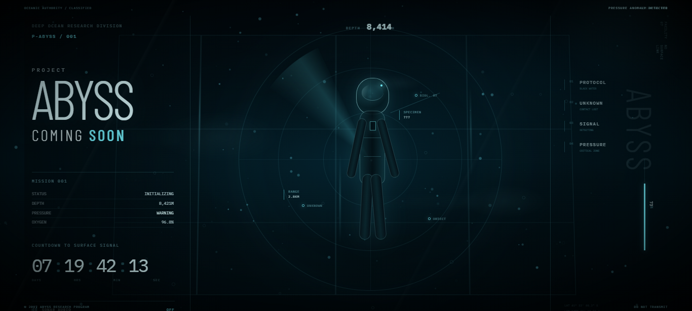

  

# ABYSS PROTOCOL // COMING SOON

A cinematic deep-ocean interface and interactive teaser for **Abyss Protocol**, built with vanilla HTML, CSS, Canvas, and JavaScript.

The experience presents a fictional deep-sea research environment through an interactive HUD, sonar visualization, environmental particles, simulated telemetry, and atmospheric interface effects.

## ✅ Features

* Cinematic deep-ocean environment
* Canvas-based underwater particles and bubbles
* Interactive cursor glow
* Dynamic parallax movement
* Animated sonar radar and detection targets
* Animated deep-sea researcher
* Simulated depth telemetry
* Live UTC clock
* Countdown system
* Dynamic mission progress
* Environmental status indicators
* Pressure anomaly warning
* Procedural sonar audio using the Web Audio API
* Responsive desktop and mobile layouts
* No frontend framework required

## ✅ Technology

* HTML5
* CSS3
* JavaScript
* HTML Canvas API
* Web Audio API
* CSS Animations
* Google Fonts

## 🌐 Live Demo

**GitHub Pages**

https://starvixhub.github.io/Abyss-Protocol-Coming-Soon/

## 🎨 CodePen

**Interactive CodePen Version**

https://codepen.io/editor/sinarezaei/pen/01a0e2ee-9a89-7a70-95db-33d78c5827fe

## 🚧 Project Status

**COMING SOON**

This repository contains the public-facing interactive teaser for Abyss Protocol.

The current experience is focused on atmosphere, interface design, interaction, and visual identity. The underlying Abyss Protocol project has not been publicly revealed.

## 📄 License

This project is licensed under the **MIT License**.

See [`LICENSE`](LICENSE) for details.

---

**Designed & Developed by Sina Rezaei**
